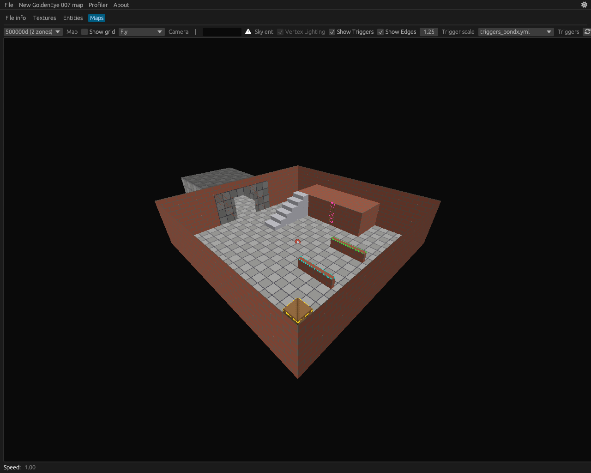
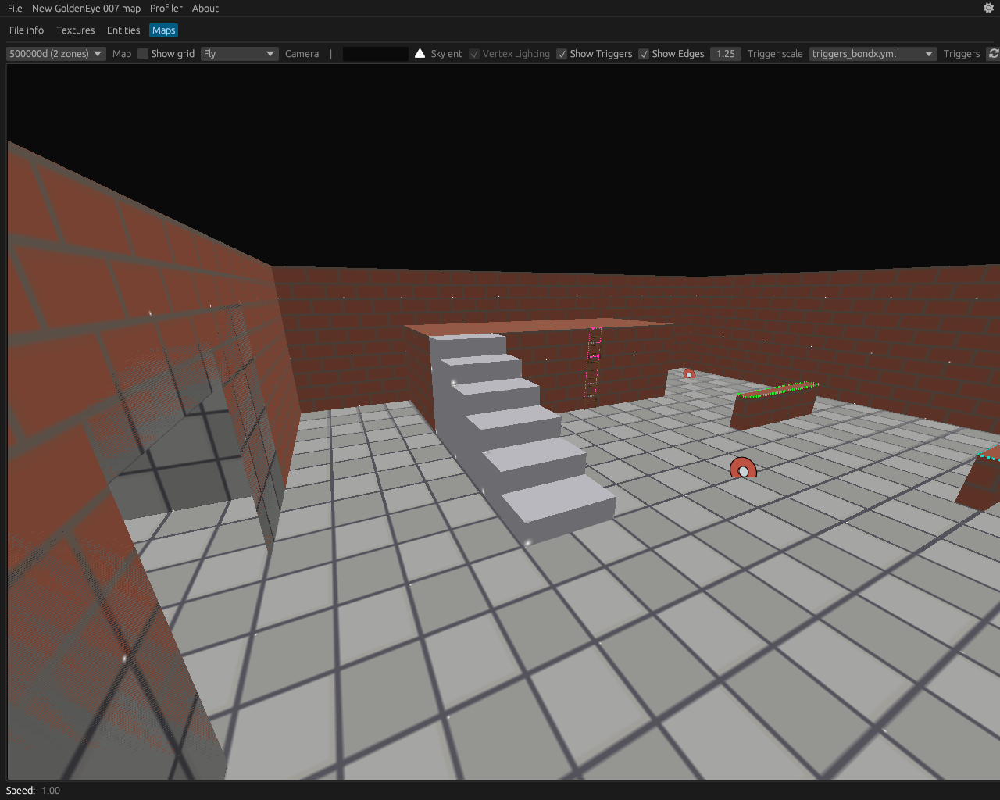
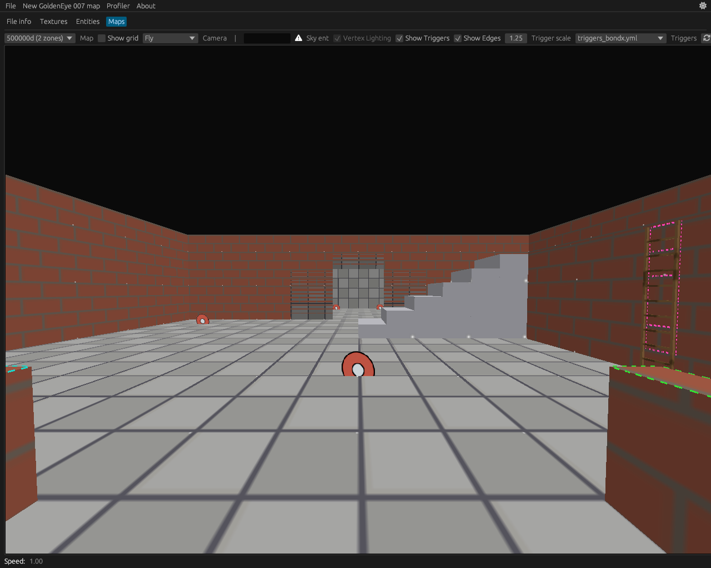
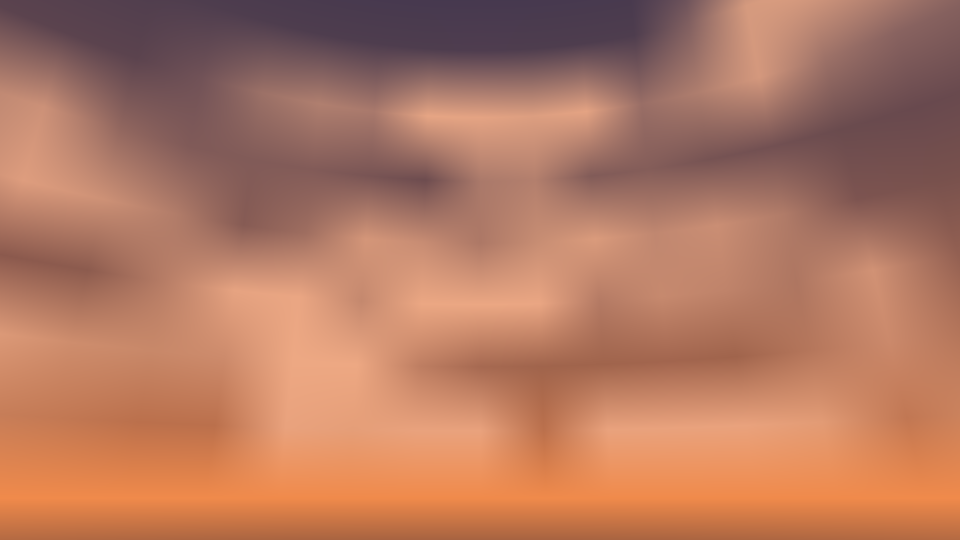
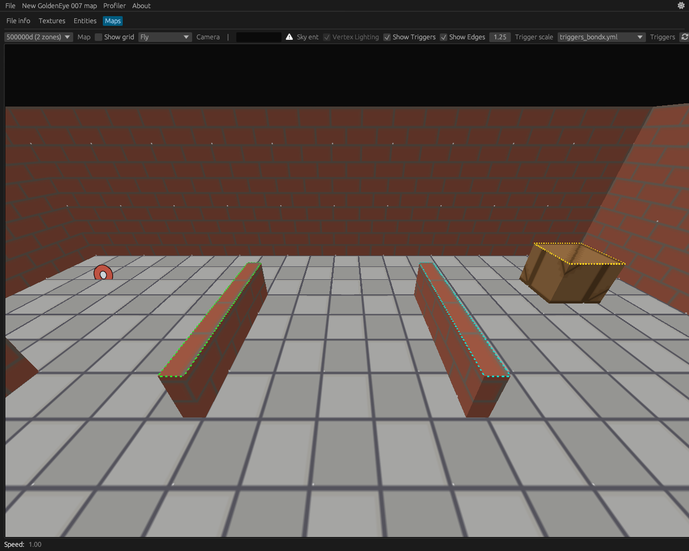
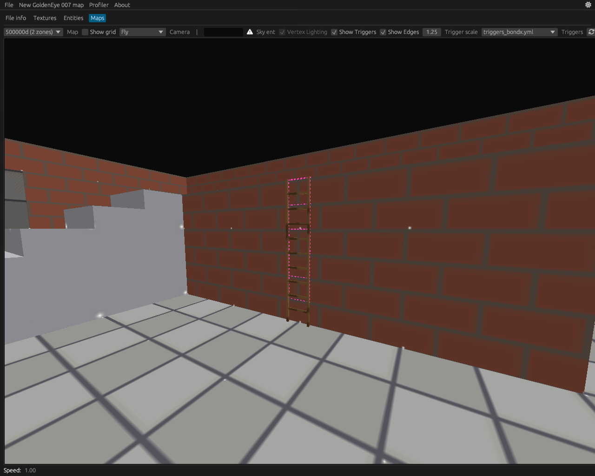
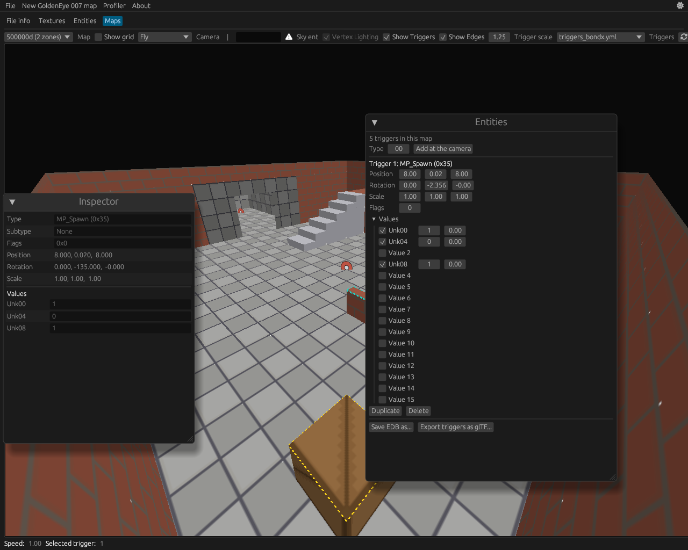
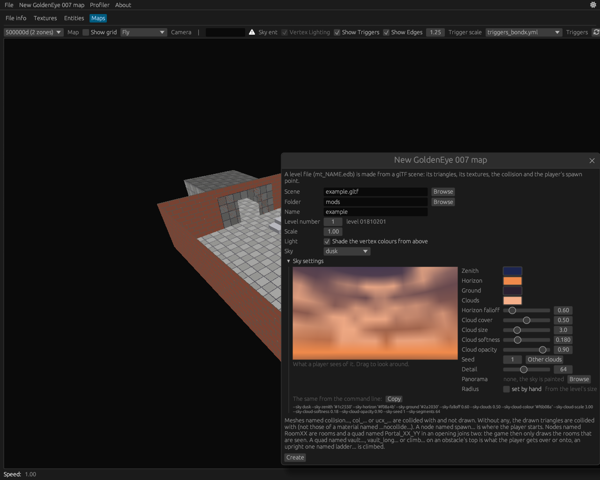

# Eurochef for GoldenEye 007 (Wii)
This fork of [Eurochef](https://github.com/eurotools/eurochef) can make new levels for GoldenEye 007 on the Wii (the 2010 one, EDB version 263). Model something in Blender, export it as glTF, and eurochef will poop out an `mt_NAME.edb` which the game loads as a level.
It consists out of three parts:
- The importer
- The CLI
- The viewer

Along with a smaller fourth entry, the example scene.
This document is the "how do I use it" one. If you want to know what the bytes mean, that's [goldeneye_wii.md](goldeneye_wii.md).

# Quick overview
## The importer
Reads a glTF scene (`.gltf` or `.glb`) and turns it into a level: triangles, textures, collision, rooms and portals, a sky, spawn points, things to vault over and ladders. You don't talk to it directly, both the CLI and the viewer use it.
It has no settings file and no custom properties. Everything is decided by **what you name things**. This sounds dumb but it means it works from any modelling program that can name an object.

## The CLI
`eurochef-cli ge ...`. Makes levels, lists and edits triggers, lists edges and ladders.

## The viewer
The Eurochef window. Opens the level you just made, shows the triggers, lets you move them around and save the file again. It also draws the vault edges and ladders now, so you can see whether they ended up where you thought they would.

## The example scene
[usage-ge/example.gltf](usage-ge/example.gltf). One small file that uses every feature in this document: two rooms with a portal, a sky, stairs with a ramp over them, a wall to vault, a fence to vault further, a crate to climb, a ladder, spawn points and a reference figure. Every screenshot below is that scene. Open it in Blender next to this document, it'll make a lot more sense.



# Making a level
Build the thing first (`cargo build --release`, you get `target/release/eurochef-cli` and `target/release/eurochef`). Then:
```
eurochef-cli ge new-map docs/usage-ge/example.gltf --name example --id 9 -o mods/
```
and it tells you what it made:
```
docs/usage-ge/example.gltf: 298 drawn triangles in 2 meshes, 242 collision triangles in 2 meshes, 4 textures
2 rooms, 1 portals
12 edges to vault over or climb
1 ladders
4 multiplayer spawn points
a sky of 10 triangles
bounds -20.00 0.00 -10.00 to 10.00 5.00 10.00, the player starts at -0.00 0.00 0.00
mods/mt_example.edb (level 01810209, 62816 bytes)
```
That's it. One file, `mt_example.edb`. Put it in the game's `mods` folder and it shows up under Extras > Mods*.
Read that output, by the way. If it says `0 ladders` and you made a ladder, you named something wrong, and it's a lot faster to notice here than after walking into a wall for a minute.

<sub>*In the recompiled PC port, which is what loads loose `.edb` files. The level's number (`--id`) decides its hash: 1 is `01810201`, 9 is `01810209`. Two levels with the same number? The second one gets the next free one.</sub>

| Option | What it does |
|--------|--------------|
| `--name` | The file becomes `mt_NAME.edb` |
| `--id` | The level's number, its hash is `0181 0200 + id` |
| `-o` | The folder it goes in |
| `--spawn x,y,z` | Where the player starts, in the game's coordinates. Wins over the scene's `spawn` node |
| `--scale` | Game units for one unit of the scene. The game is in metres, so is glTF, so leave it |
| `--no-light` | Don't shade the vertex colours by a light from above |
| `--linear-colours` | Keep the colours as glTF has them (darker) |
| `--gltf-double-sided` | Believe glTF's "double sided" flag (see Colours and sides) |
| `--sky PRESET` | Make a sky around the level (see The sky) |

## The names
This is the whole interface. A mesh or a node (an object in Blender) whose name **starts with** one of these is that thing. Case doesn't matter, and Blender's `.001` at the end is fine.

| Name starts with | What it is | Drawn | Collided with |
|------------------|------------|-------|---------------|
| anything else | The level | yes | yes* |
| `collision`, `col_`, `ucx_` | Collision, in place of the drawn triangles | no | yes |
| `collision_add`, `col_add` | Collision on top of everything else | no | yes |
| `spawn`, `player_start` | Where the player starts | — | — |
| `mp_spawn` | A multiplayer spawn point | — | — |
| `mp_spawn_team0`, `mp_spawn_team1` | A team's spawn point | — | — |
| `RoomXX` | A room, with everything below it | yes | yes |
| `Portal_XX_YY` | The opening between rooms XX and YY | no | no |
| `sky` | The sky, with everything below it | yes | no |
| `vault` | An obstacle's top the player vaults over | no | no |
| `vault_long` | The same, but further | no | no |
| `climb` | An obstacle's top the player climbs onto | no | no |
| `ladder` | A ladder | no | no |
| `reference`, `ref_` | Something to model against, left out completely | no | no |

And two for materials, these go **anywhere in** the material's name:
| Material name has | What it does |
|-------------------|--------------|
| `nocollide` | Its triangles are drawn but walked through |
| `twosided`, `nocull` | Its triangles are drawn from behind as well |

<sub>*Unless the scene has a `collision...` mesh, then only that is collided with.</sub>

Notice how "starts with" is doing a lot of work in that table. I named the wooden rungs of the example's ladder `ladder_rungs` at first, the importer took them for a second ladder and told me off for it. They're called `rungs` now.

## Units and mirroring
Metres. The player is 0.5 wide and 1.7 tall, the eye is at 1.5 standing and 0.9 crouched. [player_size_reference.gltf](../player_size_reference.gltf) is a figure that size, put it in a node named `reference_player` and it stays out of the level (the example has one next to the spawn point, you'll only ever see it in Blender).
The game's levels are the mirror image of glTF: x gets negated on import. You don't have to care about this while modelling, the level looks the way you made it. You do have to care when you type coordinates (`--spawn`, moving triggers): **what is at x 5 in Blender is at x -5 in the game**. Everything the CLI prints is in the game's coordinates.

## Colours and sides
The game draws levels unlit, the light is in the vertex colours. So the importer shades them by a fixed light from above (floors bright, walls a bit darker), which is why the example doesn't look like a grey blob. If you baked your own light into the vertex colours, pass `--no-light`.
Colours get made sRGB, so a grey you painted as 0.5 comes out as 0.5.
Triangles are drawn from their front only, where Blender's normal points. Blender marks every material without Backface Culling as "double sided" in glTF, which would make everything double sided, so that flag is ignored unless you pass `--gltf-double-sided`. Want one fence to be seen from both sides? Name its material `fence_twosided`.
Textures are resized to powers of two between 8 and 1024. Alpha is one bit: there or not there.

## Collision
By default what you see is what you walk on. That's fine for a box room and annoying for stairs: the body bumps up every single step.
The fix is a ramp nobody sees. In the example the steps have a material named `steps_nocollide` (drawn, walked through) and there's a quad over them named `collision_add_ramp` (not drawn, walked on):



`collision_add...` comes **on top of** what's already collided with. `collision...` (without the add) **replaces** all of it: the moment one of those is in the scene, the drawn triangles aren't collided with at all and you're on the hook for the whole level's collision.

## Spawn points
- `spawn`: an empty where the player starts. Without one you start on the floor in the middle of the scene, which is usually inside something.
- `mp_spawn`, as many as you want (`mp_spawn.001`, `mp_spawn_roof`...). The player looks along the node's own +z, that's -y in Blender.
- `mp_spawn_team0...` and `mp_spawn_team1...` for team games.

Multiplayer spawn points get put on the floor below them. One that hangs over nothing gets a warning, and you want to listen to that one: the game checks every one of them when the level loads, single player too, and stops in an endless loop **on purpose** when one has no floor within a metre below it.

## Rooms and portals
Without rooms the level is one zone and the game draws all of it that's in front of the camera, walls or not. With them it draws the room you're in, and through each portal on screen the room behind it.

- A node named `RoomXX` is a room, with everything below it. `Room01`, `Room_01`, `Room01_walls` and `Room01.001` are all room 01.
- A node named `Portal_XX_YY` is the opening between rooms XX and YY: a flat quad that fills the door. Which way it faces doesn't matter.
- Triangles in no room go to the room they lie in.

The example has `Room01` (the yard) and `Room02` (the hall) with `Portal_01_02` in the door between them. The viewer says `2 zones` in the top left:



A room is **only** ever seen through portals. A hole between two rooms without a portal shows nothing behind it, and a room without any portal is only drawn from inside. The importer warns about the second one. Make the portal as large as the opening or a bit larger, never smaller.
Rooms should be closed but for their portals, since which room a spot belongs to is found by looking at the walls around it. 255 rooms at most, which should do.

## The sky
A node named `sky` is the sky: a dome or a box around the whole level with its faces turned **inwards**. The game draws it where it stands (it doesn't follow the camera), so it has to be larger than the level. Nothing collides with it and the importer's light leaves it alone, give it its colours yourself. The example's is a box with vertex colours, light at the horizon and blue above.

### Or let eurochef make one
Modelling a sky dome by hand gets old fast, so `ge new-map` can make it for you: a sphere around the whole level with the sky painted into its vertex colours.
```
eurochef-cli ge new-map level.glb --name yard -o mods/ --sky dusk --sky-clouds 0.5
```
The sphere's middle and size come from the level, so there's nothing to place. If the scene has a `sky` node of its own, the made one takes its place (and it tells you).
Don't want to start the game to see what `dusk` looks like? There's a preview:
```
eurochef-cli ge sky --preview sky.png --sky dusk --sky-clouds 0.5
```


`ge sky --list` lists the presets: `day`, `overcast`, `dusk`, `night` and `space`. Everything else is optional and the same for `new-map` and `sky`:

| Option | What it does |
|--------|--------------|
| `--sky PRESET` | The colours and clouds to start from |
| `--sky-zenith`, `--sky-horizon`, `--sky-ground` | A colour of your own, `#RRGGBB`, the way it should look |
| `--sky-falloff` | How soon the horizon gives way to the zenith: below 1 soon, above 1 late (0.6) |
| `--sky-clouds` | How much of the sky the clouds take, 0 to 1 |
| `--sky-cloud-colour`, `--sky-cloud-scale`, `--sky-cloud-softness`, `--sky-cloud-opacity` | What they look like. A larger scale is smaller clouds |
| `--sky-seed` | Another number, other clouds |
| `--sky-texture pano.png` | A picture of the whole sky unrolled (2:1, `.png`, `.jpg` or `.tga`) in place of the painted one |
| `--sky-radius`, `--sky-centre x,y,z` | Where the sphere is, if you know better than the level's bounds |
| `--sky-segments` | Around the sphere (64). More is smoother clouds and more triangles |

`ge sky --preview` also takes `--look AROUND,UP` in degrees, to look somewhere else than slightly up.
The clouds are painted per vertex, so they're soft blobs and not crisp. For crisp, use `--sky-texture`.

## Vaults and climbs
What the player can vault over isn't the collision. It's a list of edges, and you make them by putting a quad on top of the obstacle:

| Name | What the player does | Ends up |
|------|----------------------|---------|
| `vault...` | Vaults over | About 1.25 m behind the edge |
| `vault_long...` | Vaults over, further | About 1.6 m behind the edge |
| `climb...` | Climbs up | Standing on top |

The quad (or a box, only the faces that look up count) ends where the obstacle's top ends. Its rim becomes the edges, each one taken from outside. Not drawn, not collided with, it's only a marker.



Green is the wall to vault, teal the fence to vault further, yellow the crate to climb. Things to know:
- The top has to be **0.5 to 1.5 m above the floor** in front of it (the game's own are all 1.1). The importer warns about one that isn't.
- The way is always as long as the table says, whatever is there. A `vault` over a wall 0.4 thick lands behind it. Over one 1.3 thick it ends on top of it. Pick the one that fits the obstacle.
- In game it's the action button (b on the classic controller) with the stick forward, facing the edge.

## Ladders
The new one. A ladder is a mesh named `ladder...`: **one flat upright quad** that
- looks at the player on it (its front, where Blender's normal points, is the side you climb),
- is as wide as the ladder (the game's own are 0.4 to 0.5),
- goes from the floor up to where the player gets off, so the top of the platform.

That's the whole thing. It may lean. It isn't drawn and isn't collided with, so model the actual ladder as a normal mesh next to it (and don't name that one `ladder`, see above).



The pink lines are what the importer made of it. The game wants a ladder as a column of pieces half a metre tall plus an edge at the top where you get off, so the quad gets cut up:
```
$ eurochef-cli ge edges mods/mt_example.edb
a zone's entity at 0xc920: 13 edge(s), 5 polygon(s)
  ...
  0100 ladder top 0.25 3.00 6.00 > -0.25 3.00 6.00
  1000 ladder     0.00 0.50 6.00 > 0.00 3.00 6.00, 5 piece(s)
```
Notice how the ladder starts at 0.50 while the quad started at the floor. That's on purpose. A ladder whose pieces go all the way down works fine going up, and going down the player reaches the bottom and **never gets off again**. Stuck on the ladder forever. The game's own ladders all end half a metre above the floor, so the importer does the same with yours and you can just draw the quad from the floor.

How it plays:
| You | The player |
|-----|------------|
| Walk into the foot of it | Gets on, climbs with the stick, gets off onto the platform at the top |
| Back off the platform's edge above it | Grabs it, climbs down, steps off at the bottom |

And what the importer says when it doesn't like one:
| Warning | Meaning |
|---------|---------|
| `has no face that looks sideways, it is no ladder` | It's lying flat, or it's a closed box (its faces cancel out). Make it a single quad |
| `looks into the wall behind it ... turn it around` | The quad faces the wall instead of the climber. Flip its normal |
| `has no floor in front of its foot` | Nothing to stand on in front of it |
| `starts ... above the floor ... only got onto from its top` | The foot is too high to walk onto. Fine if that's what you want |
| `too low for a ladder: left out` | Less than a metre tall. Use a `climb` |

<sub>Ladders in a level with rooms just work, the importer gives each one to the rooms the player is in while on it.</sub>

# Looking at what you made
## In the terminal
```
eurochef-cli ge edges mt_example.edb
eurochef-cli ge triggers mt_example.edb
```
`ge edges` lists every edge with its flags and every ladder with its foot, its top and how many pieces it has. It works on the game's own levels too, which is how I found out what a ladder should look like (Carrier has three).
`ge triggers` lists the triggers, more on those below.

## In the viewer
Open the `.edb` (drag it in, or `eurochef mt_example.edb`) and go to the Maps tab. **Show Edges** in the toolbar draws the edges and ladders over the level:

| Colour | What |
|--------|------|
| Green | `vault` |
| Teal | `vault_long` |
| Yellow | `climb` |
| Pink | A ladder: its pieces and the edge at its top |
| Grey | Edges of the game's own levels that aren't any of these |

An edge you expected isn't there? Either the name is off, or the quad is upside down: only faces that look **up** make edges, and the importer says so (`has no face that looks up`).

# Triggers
Triggers are the game's "entities": spawn points, enemies, doors, the things that load other files. A new level has one for the player's spawn and one for each multiplayer spawn point.

## From the terminal
```
$ eurochef-cli ge triggers mods/mt_example.edb
5 trigger(s) in mods/mt_example.edb
  0  type  28 (0x1c)  at    -0.000     0.000     0.000  rot  0.000 -0.000 -0.000  ...
  1  type  53 (0x35)  at     8.000     0.020     8.000  rot  0.000 -2.356 -0.000  d0=0x1  d1=0x0  d3=0x1
  2  type  53 (0x35)  at    -8.000     0.020    -8.000  rot  0.000  0.785 -0.000  d0=0x1  d1=0x0  d3=0x1
  ...
```
`0x1C` is the player's spawn point, `0x35` a multiplayer one. To change them:
```
eurochef-cli ge edit-triggers mt_example.edb -o out.edb --move 1:6,0.02,6 --add 0x35:0,0.02,-8 --remove 4
```
| Option | Format | What it does |
|--------|--------|--------------|
| `--move` | `INDEX:x,y,z` | Moves a trigger |
| `--rotate` | `INDEX:x,y,z` | Turns it (radians) |
| `--set` | `INDEX:SLOT=VALUE` | Sets one of its 16 data values. `0x` for hex, a decimal point for a float, `none` clears it |
| `--copy` | `INDEX:x,y,z` | Adds a copy of it somewhere else |
| `--add` | `TYPE:x,y,z` | Adds a new one. Spawn points get the values the game's own have |
| `--remove` | `INDEX` | Removes one |

All of them can be given more than once. The indices are the ones `ge triggers` listed **before** any change, so you don't have to do sums when you remove two.
This works on the game's own level files as well (all the `mt_` ones but `mt_archive*`).

## Back into Blender
```
eurochef-cli ge export-triggers mt_example.edb -o triggers.gltf
```
writes the triggers as a glTF scene of empties, named the way `ge new-map` reads them: `spawn`, `mp_spawn_NNN`, `mp_spawn_teamT_NNN`, and `trigger_NNN_TYPE` for everything else (which `ge new-map` leaves alone). Import that into your scene and the spawn points are where the level has them.

## In the viewer
In the Maps tab, click a trigger and the **Entities** window lets you move it, turn it, change its values, duplicate it or delete it. *Add at the camera* adds a new one where you're looking from. *Save EDB as...* writes the file, *Export triggers as glTF...* does what `ge export-triggers` does.



# Making a level without the terminal
*New GoldenEye 007 map* in the menu bar does what `ge new-map` does and opens the result right away. Scene, folder, name, level number, a sky if you want one, done.



Pick a preset under *Sky* and the **Sky settings** open up. This is the one place where the window beats the terminal:
- a picture of the sky as a player sees it, drag it to look around,
- the four colours (zenith, horizon, ground, clouds), each a colour picker,
- sliders for the horizon's falloff and the clouds' cover, size, softness and opacity,
- the seed, with an *Other clouds* button for when you don't care which number,
- *Detail* (the sphere's segments), a panorama to use instead of the painted sky, and the sphere's radius if the level's own size isn't what you want.

Picking another preset only swaps the colours and the cloud cover, the rest stays as you set it. Under the picture is the same sky as `ge new-map` options, with a *Copy* button, so once you like it you can put it in a script.

It still has less options than the CLI for everything that isn't the sky (no `--spawn`, no `--linear-colours`). For those, well, there's a terminal.

# Things that will bite you
In no particular order, all of these got me at least once:
- **Names are prefixes.** `ladder_rungs` is a ladder. `skylight` is a sky. `collision_test_dont_use` is very much used.
- **x is mirrored** in everything you type and everything the CLI prints.
- **A multiplayer spawn point over nothing hangs the game** while loading. Read the warnings.
- **A `collision...` mesh turns off all other collision.** You wanted `collision_add...`.
- **A room without a portal is invisible from outside.** That's not a bug, that's what a room is.
- **The ladder quad faces the climber**, not the wall. The pink lines get drawn either way, so read the importer's warnings: a ladder that looks into its own wall can't be climbed.
- **Vault heights.** Under 0.5 or over 1.5 above the floor and the game ignores the edge.
